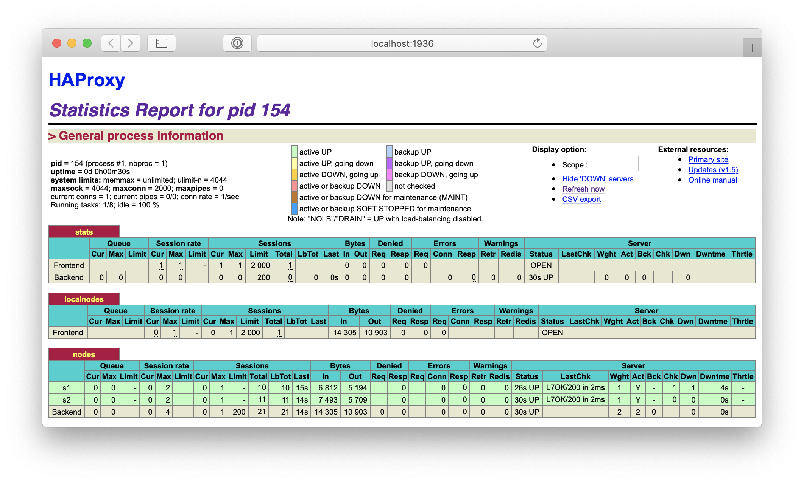

# Lab 04 – Docker

* **Date**: 04.12.2019
* **Auteurs**: Nikolaos Garanis, Samuel Mettler.
* **Repository**: <https://github.com/nyg/Teaching-HEIGVD-AIT-2019-Labo-Docker>

## Summary

* [Introduction](#introduction)
* [Task 0: Identify issues and install the tools](#task-0)
* [Task 1: Add a process supervisor to run several processes](#task-1)
* [Task 2: Add a tool to manage membership in the web server cluster](#task-2)
* [Task 3: React to membership changes](#task-3)
* [Task 4: Use a template engine to easily generate configuration files](#task-4)
* [Task 5: Generate a new load balancer configuration when membership changes](#task-5)
* [Task 6: Make the load balancer automatically reload the new configuration](#task-6)
* [Difficulties](#difficulties)
* [Conclusion](#conclusion)

## <a name="introduction"></a>Introduction

## <a name="task-0"></a>Task 0: Identify issues and install the tools

Screenshot of the HAProxy statistics page.


> **[M1] Do you think we can use the current solution for a production environment? What are the main problems when deploying it in a production environment?**

The main problem is that if a node goes down (or the load balancer itself), there is no supervisor that will bring them up again (or start new ones). Another issue is that, as we can see in the next question, adding another node is pretty cumbersome and cannot be done dynamically.

> **[M2] Describe what you need to do to add new webapp container to the infrastructure. Give the exact steps of what you have to do without modifiying the way the things are done. Hint: You probably have to modify some configuration and script files in a Docker image.**

We must add two environment variables in the `.env` file:

```
WEBAPP_3_NAME=s3
WEBAPP_3_IP=192.168.42.33
```

Then we must add a new service in the `docker-compose.yml` file and add the two new environment variables to the haproxy service:

```
webapp3:
  container_name: ${WEBAPP_3_NAME}
  build:
    context: ./webapp
    dockerfile: Dockerfile
  networks:
    public_net:
      ipv4_address: ${WEBAPP_3_IP}
  ports:
    - "4002:3000"
  environment:
    - TAG=${WEBAPP_3_NAME}
    - SERVER_IP=${WEBAPP_3_IP}

haproxy
  ...
  environment:
    ...
    - WEBAPP_3_IP=${WEBAPP_3_IP}
```

We must add a third node in the `haproxy.cfg` file:

```
backend nodes
	server s3 ${WEBAPP_3_IP}:3000 check
```

In the `run-daemon.sh` and `run.sh` we must also add a line to handle the new node:

```sh
sed -i 's/<s3>/$S3_PORT_3000_TCP_ADDR/g' /usr/local/etc/haproxy/haproxy.cfg
```

> **[M3] Based on your previous answers, you have detected some issues in the current solution. Now propose a better approach at a high level.**

A better approach would be for the load balancer to automatically detect new  nodes that are available and ready to receive requests. I would also be interesting to have a kind of supervisor that will detect if a node is down and if that happens start a new one.

> **[M4] You probably noticed that the list of web application nodes is hardcoded in the load balancer configuration. How can we manage the web app nodes in a more dynamic fashion?**

We could define a protocol where a node can broadcast its availability. When the load balancer detects a new node that is available, it will consider it when doing load balancing.

> **[M5] In the physical or virtual machines of a typical infrastructure we tend to have not only one main process (like the web server or the load balancer) running, but a few additional processes on the side to perform management tasks.**
>
> **For example to monitor the distributed system as a whole it is common to collect in one centralized place all the logs produced by the different machines. Therefore we need a process running on each machine that will forward the logs to the central place. (We could also imagine a central tool that reaches out to each machine to gather the logs. That's a push vs. pull problem.) It is quite common to see a push mechanism used for this kind of task.**
>
> **Do you think our current solution is able to run additional management processes beside the main web server / load balancer process in a container? If no, what is missing / required to reach the goal? If yes, how to proceed to run for example a log forwarding process?**

We would need to update the Dockerfile of each node so this additional management process is started. We would also need to define specifically how the different instances of the process will communicate between each other.

> **[M6] In our current solution, although the load balancer configuration is changing dynamically, it doesn't follow dynamically the configuration of our distributed system when web servers are added or removed. If we take a closer look at the `run.sh` script, we see two calls to `sed` which will replace two lines in the `haproxy.cfg` configuration file just before we start HAProxy. You clearly see that the configuration file has two lines and the script will replace these two lines.**
>
> **What happens if we add more web server nodes? Do you think it is really dynamic? It's far away from being a dynamic configuration. Can you propose a solution to solve this?**

We need to add more lines as mentionned in the M2 question. One solution would be to add all possible IP in the configuration file. HAProxy will consider most of them down, but this is not a problem as long as it can detect when a new node is started. But this is not a very solution because HAProxy will send HEAD requests for all IPs, which is a waste of resources.

## <a name="task-1"></a>Task 1: Add a process supervisor to run several processes

> **1. Take a screenshot of the stats page of HAProxy at  <http://192.168.42.42:1936>. You should see your backend nodes. It should be really similar to the screenshot of the previous task.**



> **2. Describe your difficulties for this task and your understanding of what is happening during this task. Explain in your own words why are we installing a process supervisor. Do not hesitate to do more research and to find more articles on that topic to illustrate the problem.**

The life of a Docker container is tied to the life of the process which we start (e.g. haproxy, node) when creating the container. If this process stops, the container will also stop. This is called the entrypoint of the container. What we have done in this task is to replace this entrypoint by another process called S6 which gives us the ability to start and stop other processes in the container, without the container being stopped. For the moment, we have only told S6 to start either node or haproxy, depending on the Docker image.

S6 will allow us to start a supervisor in each container which will report on the status of the "main" process (i.e. haproxy and node).

## <a name="task-2"></a>Task 2: Add a tool to manage membership in the web server cluster

**Deliverables**:

> **1. Provide the docker log output for each of the containers: `ha`, `s1` and `s2`.**

There are two folders in the `logs/task-2` folder:
* `order-ha-s1-s2` contains the logs of ha, s1, s2 when started in this order,
* `order-s1-s2-ha` contains the logs of s1, s2, ha when started in this order.

> **2. Give the answer to the question about the existing problem with the current solution.**

> **3. Give an explanation on how `Serf` is working. Read the official website to get more details about the `GOSSIP` protocol used in `Serf`. Try to find other solutions that can be used to solve similar situations where we need some auto-discovery mechanism.**

## <a name="task-3"></a>Task 3: React to membership changes

**Deliverables**:

1. Provide the docker log output for each of the containers:  `ha`, `s1` and `s2`. Put your logs in the `logs` directory you created in the previous task.

3. Provide the logs from the `ha` container gathered directly from the `/var/log/serf.log` file present in the container. Put the logs in the `logs` directory in your repo.

## <a name="task-4"></a>Task 4: Use a template engine to easily generate configuration files

**Deliverables**:

1. You probably noticed when we added `xz-utils`, we have to rebuild the whole image which took some time. What can we do to mitigate that? Take a look at the Docker documentation on [image layers](https://docs.docker.com/engine/userguide/storagedriver/imagesandcontainers/#images-and-layers). Tell us about the pros and cons to merge as much as possible of the command. In other words, compare:

  ```
  RUN command 1
  RUN command 2
  RUN command 3
  ```

  vs.

  ```
  RUN command 1 && command 2 && command 3
  ```

  There are also some articles about techniques to reduce the image size. Try to find them. They are talking about `squashing` or `flattening` images.

2. Propose a different approach to architecture our images to be able to reuse as much as possible what we have done. Your proposition should also try to avoid as much as possible repetitions between your images.

3. Provide the `/tmp/haproxy.cfg` file generated in the `ha` container after each step.  Place the output into the `logs` folder like you already did for the Docker logs in the previous tasks. Three files
   are expected.
   
   In addition, provide a log file containing the output of the `docker ps` console and another file (per container) with `docker inspect <container>`. Four files are expected.
   
4. Based on the three output files you have collected, what can you say about the way we generate it? What is the problem if any?

## <a name="task-5"></a>Task 5: Generate a new load balancer configuration when membership changes

**Deliverables**:

1. Provide the file `/usr/local/etc/haproxy/haproxy.cfg` generated in the `ha` container after each step. Three files are expected.
  
   In addition, provide a log file containing the output of the `docker ps` console and another file (per container) with `docker inspect <container>`. Four files are expected.

2. Provide the list of files from the `/nodes` folder inside the `ha` container. One file expected with the command output.

3. Provide the configuration file after you stopped one container and the list of nodes present in the `/nodes` folder. One file expected with the command output. Two files are expected.
  
    In addition, provide a log file containing the output of the `docker ps` console. One file expected.

4. (Optional:) Propose a different approach to manage the list of backend nodes. You do not need to implement it. You can also propose your own tools or the ones you discovered online. In that case, do not forget to cite your references.

## <a name="task-6"></a>Task 6: Make the load balancer automatically reload the new configuration

**Deliverables**:

1. Take a screenshots of the HAProxy stat page showing more than 2 web applications running. Additional screenshots are welcome to see a sequence of experimentations like shutting down a node and starting
   more nodes.
   
   Also provide the output of `docker ps` in a log file. At least one file is expected. You can provide one output per step of your experimentation according to your screenshots.
   
2. Give your own feelings about the final solution. Propose improvements or ways to do the things differently. If any, provide references to your readings for the improvements.

3. (Optional:) Present a live demo where you add and remove a backend container.

## <a name="difficulties"></a>Difficulties found

## <a name="conclusion"></a>Conclusion
